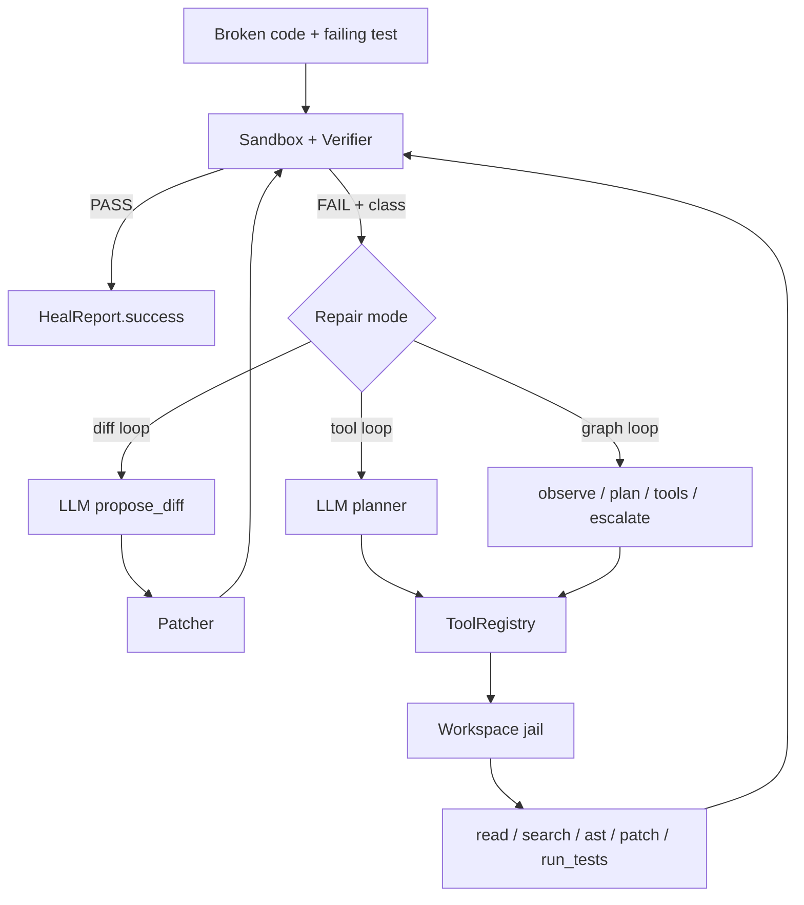
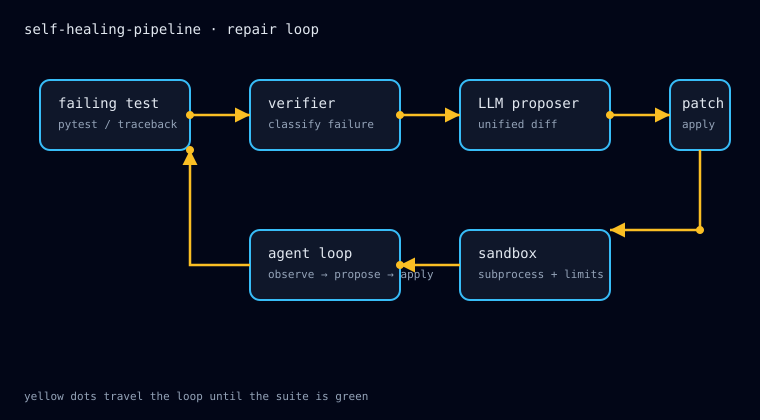
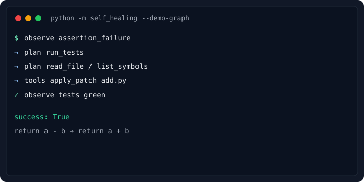

# self-healing-pipeline

[](https://github.com/OlegUnreal/self-healing-pipeline/actions/workflows/ci.yml)

The model proposes. The jail executes. Tests decide.

An agent that runs a failing test, reads the traceback, and repairs the workspace until the suite is green.

There are three repair modes:

1. **Diff loop** — the model emits one unified diff per attempt.
2. **Tool loop** — the model calls a sandboxed set of Python tools (`read_file`, `search_text`, `apply_patch`, `run_tests`, …).
3. **Graph loop** — the same tools, routed as Observe → Plan → Tools. LangGraph is an *optional* runtime for that graph, not a required dependency.

## Why this exists

Most "AI coding agent" demos are a single LLM call wrapped in `while True`. The real difficulty is not the model — it is sandbox isolation, safe patches, a tool boundary, failure classification, and loop termination. This repo handles all five, with tests for each.

## Architecture

```
self_healing/
├── cli.py              # python -m self_healing
├── agent.py            # diff loop + tool-calling loop
├── graph.py            # Observe → Plan → Tools orchestrator
├── tools/              # Workspace jail + handlers + registry
├── sandbox.py / patcher.py / verifier.py
├── llm.py / config.py / logging.py
└── demo.py / demo_llm.py / demo_tools.py / demo_graph.py
```



Longer diagrams: [`docs/architecture.md`](docs/architecture.md). Tools: [`docs/tools.md`](docs/tools.md). LangGraph extra: [`docs/langgraph.md`](docs/langgraph.md). Changelog: [`CHANGELOG.md`](CHANGELOG.md).





Transcript: [`docs/demo-transcript.md`](docs/demo-transcript.md).

## How to run

```bash
git clone https://github.com/OlegUnreal/self-healing-pipeline.git
cd self-healing-pipeline
python -m venv .venv && source .venv/bin/activate
pip install -r requirements.txt

python -m self_healing --demo
python -m self_healing --demo-tools
python -m self_healing --demo-graph

python -m self_healing \
  --src examples/add.py \
  --test examples/test_add.py \
  --mode graph --planner stub --stream

cp .env.example .env
python -m self_healing --demo-llm
pytest -q
```

Optional LangGraph runtime:

```bash
pip install -r requirements-langgraph.txt
python -m self_healing --src examples/add.py --test examples/test_add.py \
  --mode graph --use-langgraph --checkpoint /tmp/heal.sqlite
```

`--approve-mutations` pauses before `write_file` / `apply_patch`. Combine with `--yes` to auto-approve.

## Libraries used and why

| Library | Why | How integrated |
|---|---|---|
| `openai>=1.40` | Official SDK for chat + tool calling. | `llm.py` — proposer and planner. |
| `pytest>=8.0` | Test runner and the *subject* of the pipeline. | CI never needs an API key. |
| `python-dotenv>=1.0` | Secrets stay out of source. | `config.load_settings()`. |
| stdlib `ast` | Surgical function extract. | `list_symbols` / `extract_function`. |
| stdlib `subprocess` + `resource` | Process isolation + `RLIMIT_AS`. | `sandbox.run_code`. |
| system `patch` | Same tool humans use in review. | `patcher.apply_diff`. |
| `langgraph` (optional extra) | Checkpoints, streaming, HITL. | `graph.build_heal_graph()` only with `--use-langgraph`. |

No vector store and no web framework. LangGraph is opt-in so the core stay small.

## Configuration

| Variable | Default | Meaning |
|---|---|---|
| `OPENAI_API_KEY` | — | live LLM modes |
| `SHP_MODEL` | `gpt-4o-mini` | proposer / planner |
| `SHP_MAX_ATTEMPTS` | `5` | diff-loop budget |
| `SHP_MAX_TOOL_STEPS` | `12` | tool/graph budget |
| `SHP_TIMEOUT` | `30` | per-LLM-call timeout |
| `SHP_SANDBOX_TIMEOUT` | `5` | per-sandbox-run timeout |
| `SHP_SANDBOX_MEMORY_MB` | `256` | `RLIMIT_AS` cap |
| `SHP_MAX_FILE_BYTES` | `200000` | jail read/write cap |
| `SHP_USE_LANGGRAPH` | `false` | prefer LangGraph when the extra is installed |

## Design decisions

1. Subprocess sandbox instead of `exec()`.
2. Tools instead of one-shot diffs.
3. `patch -p0` instead of string surgery.
4. Failure classes instead of raw tracebacks.
5. Retries in the proposer, not the loop.
6. Workspace jail in front of every tool.
7. Graph as an orchestrator, not `create_react_agent`.

## License

MIT. See [`LICENSE`](LICENSE).
