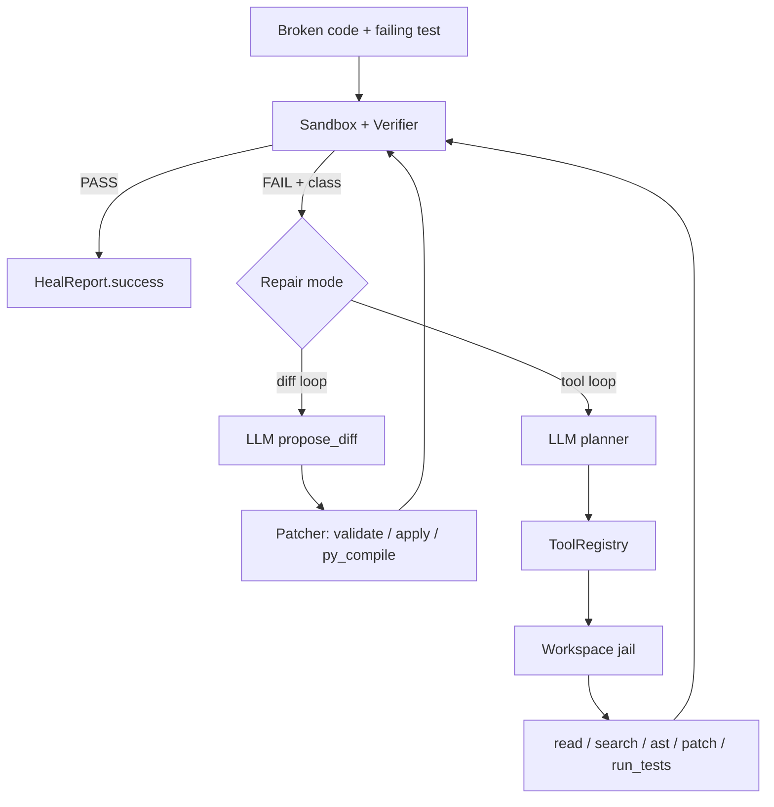
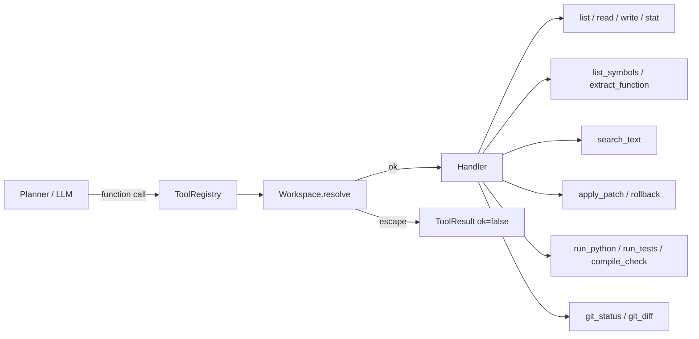

# self-healing-pipeline

An agent that runs a failing test, reads the traceback, and repairs the workspace until the suite is green.

There are two repair modes:

1. **Diff loop** — the model emits one unified diff per attempt.
2. **Tool loop** — the model calls a sandboxed set of Python tools (`read_file`, `search_text`, `apply_patch`, `run_tests`, …) the same way Cursor / Claude Code do.

This is the core repair loop behind those products, built from scratch in Python, with every hard part isolated and tested.

## Why this exists

Most "AI coding agent" demos are a single LLM call wrapped in `while True`. The real difficulty is not the model — it is:

- **Sandbox isolation** — running untrusted code without poisoning the host.
- **Safe patch application** — applying a diff without path traversal or syntax corruption.
- **A tool boundary** — the model proposes, tools execute, the jail decides.
- **Failure classification** — telling the model *why* it failed, not just dumping a raw traceback.
- **Loop termination** — avoiding infinite repair loops and burning the budget on empty diffs.

This repo handles all five, with tests for each.

## Architecture

```
self_healing/
├── agent.py            # diff loop + tool-calling loop
├── tools/
│   ├── base.py         # Workspace jail, Tool / ToolResult / ToolSpec
│   ├── handlers.py     # the actual Python tools
│   └── registry.py     # OpenAI function schemas + dispatch
├── sandbox.py          # subprocess + RLIMIT_AS
├── patcher.py          # unified diff, path-traversal rejection, py_compile
├── verifier.py         # classify failure
├── llm.py              # OpenAI proposer + planner
├── config.py           # env / .env settings
├── logging.py          # structured JSON logs
├── demo.py / demo_llm.py / demo_tools.py
```

### Pipeline



Longer diagrams: [`docs/architecture.md`](docs/architecture.md). Tool catalogue: [`docs/tools.md`](docs/tools.md).


## Python tools



| Tool | Role |
|---|---|
| `workspace_info` | Jail root and backups |
| `list_files` | Orient in the workspace |
| `read_file` | Inspect with line numbers |
| `write_file` | Full rewrite, previous bytes backed up |
| `file_stat` | Existence / size |
| `apply_patch` | Preferred mutation |
| `rollback_file` | Undo last write/patch |
| `compile_check` | `py_compile` without executing |
| `run_python` | Sandboxed snippet |
| `run_tests` | Ground truth that ends the loop |
| `search_text` | Regex search |
| `list_symbols` | Top-level functions and classes via `ast` |
| `extract_function` | Surgical extract of one `FunctionDef` |
| `classify_failure` | `syntax` / `assertion` / `import` / … |
| `git_status` / `git_diff` | Optional VCS context |

Unknown tool names return an error result instead of raising.

## How to run

```bash
git clone https://github.com/OlegUnreal/self-healing-pipeline.git
cd self-healing-pipeline
python -m venv .venv && source .venv/bin/activate
pip install -r requirements.txt

python -m self_healing --demo         # stub proposer, no key
python -m self_healing --demo-tools   # scripted tool loop, no key
cp .env.example .env                  # OPENAI_API_KEY=...
python -m self_healing --demo-llm
pytest -q
```

## Libraries used and why

| Library | Why | How integrated |
|---|---|---|
| `openai>=1.40` | Official SDK for chat completions and native tool/function calling. | `llm.py` talks only to `client.chat.completions.create`. `make_openai_proposer` returns diffs; `make_openai_planner` returns `{content, tool_calls}` that `heal_with_tools` dispatches. |
| `pytest>=8.0` | Test runner and the *subject* of the pipeline. | Unit tests inject a fake LLM client so CI never needs a key. |
| `python-dotenv>=1.0` | Load `.env` so secrets stay out of source. Optional import. | `config.load_settings()` reads `OPENAI_API_KEY` and `SHP_*`. |
| stdlib `ast` | Surgical function extract. | `list_symbols` / `extract_function`. |
| stdlib `subprocess` + `resource` | Process isolation and `RLIMIT_AS`. | `sandbox.run_code`, `patcher.apply_diff`. |
| system `patch` | Same tool humans use in review. | `patch -p0 --forward --batch` after path validation. |

No LangGraph / vector store / web framework on purpose — this repo is the control loop, not a product wrapper.

## Configuration

| Variable | Default | Meaning |
|---|---|---|
| `OPENAI_API_KEY` | — | required for `--demo-llm` |
| `SHP_MODEL` | `gpt-4o-mini` | proposer / planner model |
| `SHP_MAX_ATTEMPTS` | `5` | diff-loop budget |
| `SHP_MAX_TOOL_STEPS` | `12` | tool-loop budget |
| `SHP_TIMEOUT` | `30` | per-LLM-call timeout |
| `SHP_SANDBOX_TIMEOUT` | `5` | per-sandbox-run timeout |
| `SHP_SANDBOX_MEMORY_MB` | `256` | `RLIMIT_AS` cap |
| `SHP_MAX_FILE_BYTES` | `200000` | jail read/write cap |

## Design decisions

1. Subprocess sandbox instead of `exec()` — a bad patch must not run in-process.
2. Tools instead of one-shot diffs — real repairs need inspect → mutate → verify.
3. `patch -p0` instead of string surgery — fails loudly on context mismatch.
4. Failure classes instead of raw tracebacks — less token waste, clearer prompts.
5. Retries in the proposer, not the loop — network blips must not burn attempt budget.
6. Workspace jail in front of every tool — `../.ssh/id_rsa` becomes `ToolResult.error`.

## License

MIT.
