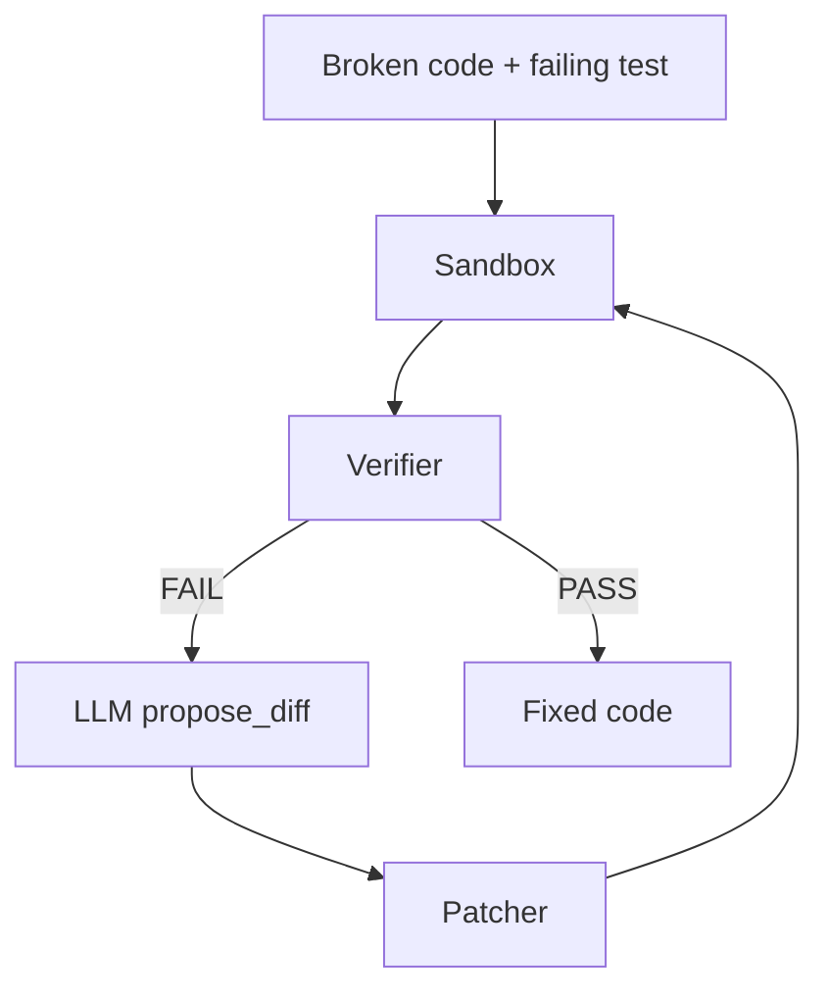

# Architecture

Three isolated layers:

| Layer | Responsibility |
|---|---|
| **Sandbox** | Runs untrusted code in a subprocess with memory limits |
| **Verifier** | Classifies failures: timeout, syntax, assertion |
| **Patcher** | Applies unified diffs, rejects path traversal |

The LLM never touches the filesystem directly — it only proposes diffs.
