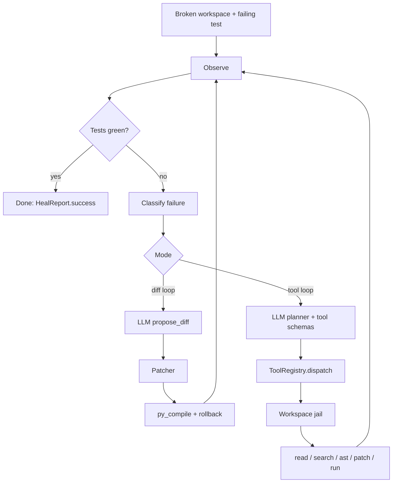
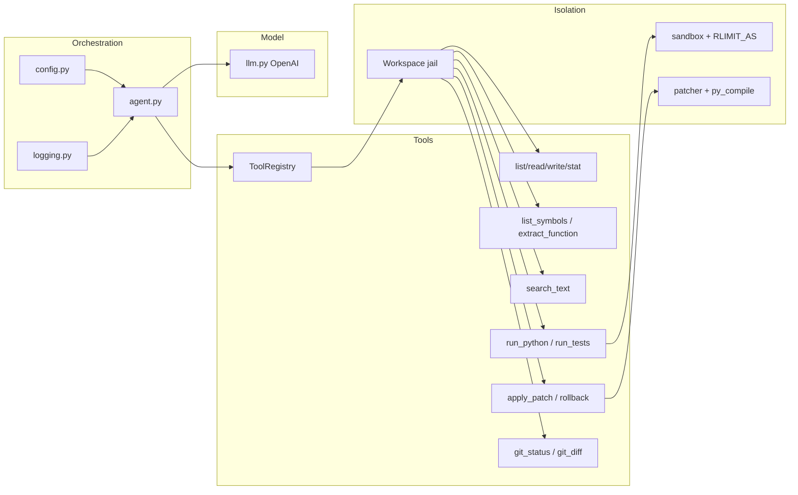
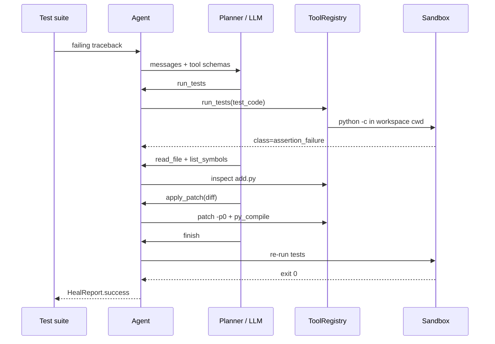

# Architecture

Self-healing-pipeline is a closed control loop around a failing Python workspace.
The model never writes to disk itself. It only *proposes* actions. A jail
(`Workspace`) plus a sandbox (`run_code`) execute those actions.

## Control loop

## Layers

## Sequence of a tool-healed repair

The model is an untrusted proposer. Tools are the capability boundary.
