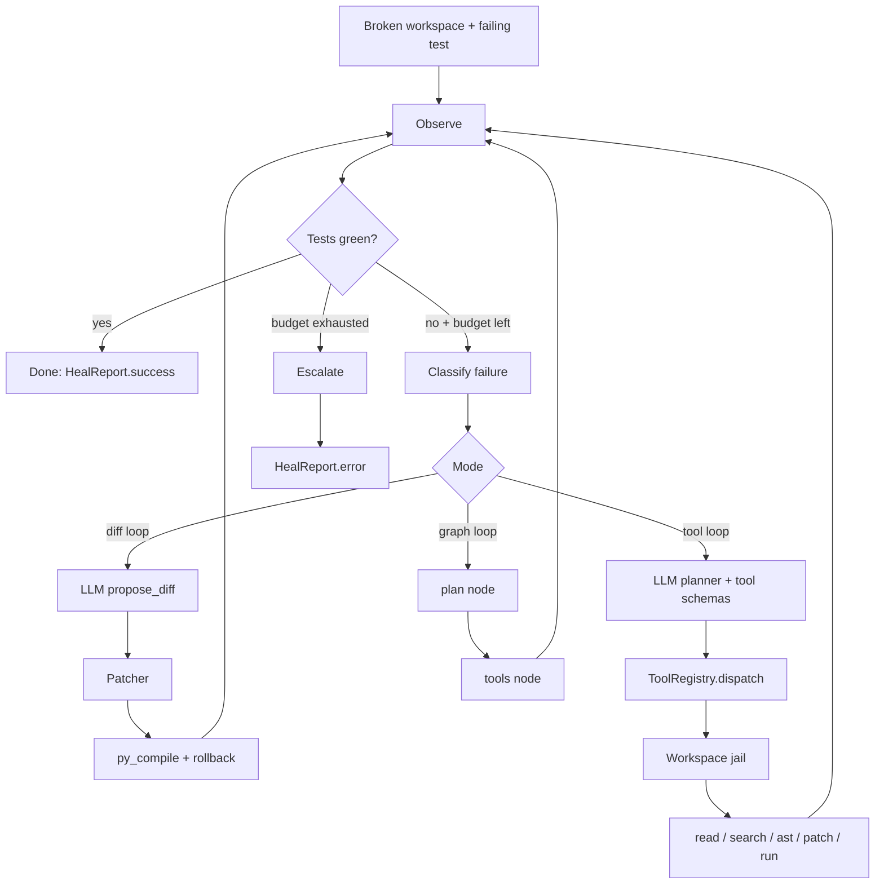
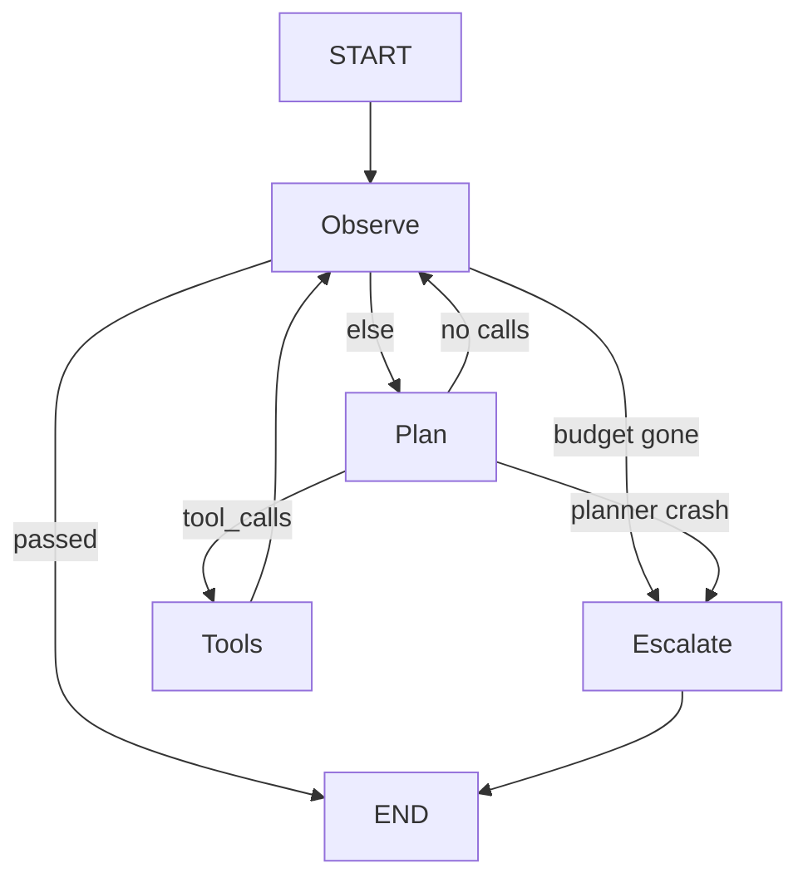

# Architecture

Self-healing-pipeline is a closed control loop around a failing Python workspace.
The model never writes to disk itself. It only *proposes* actions. A jail
(`Workspace`) plus a sandbox (`run_code`) execute those actions.

There are three orchestrators on top of the same capability boundary:

1. **Diff loop** (`heal`) — one unified diff per attempt.
2. **Tool loop** (`heal_with_tools`) — OpenAI-style function calls.
3. **Graph loop** (`heal_with_graph`) — Observe → Plan → Tools, with an optional LangGraph runtime.

## Control loop

## Graph nodes

See also `docs/langgraph.md`.

The model is an untrusted proposer. Tools are the capability boundary.
The graph is only the router.
